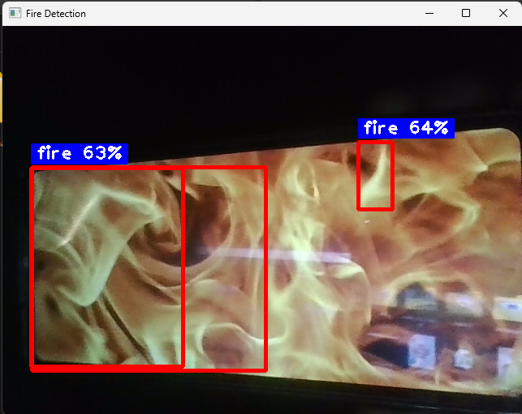
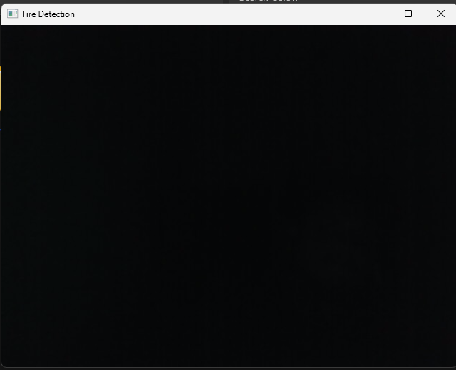
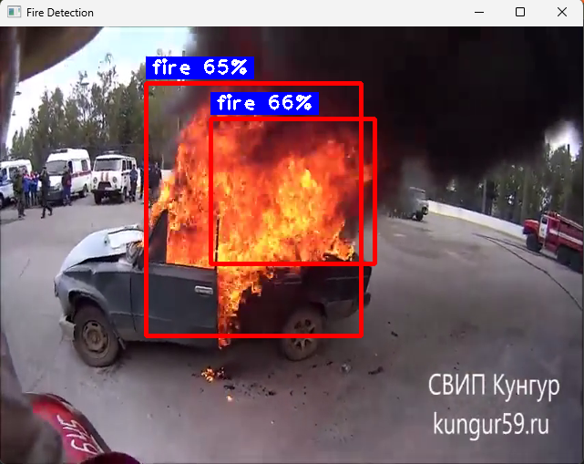
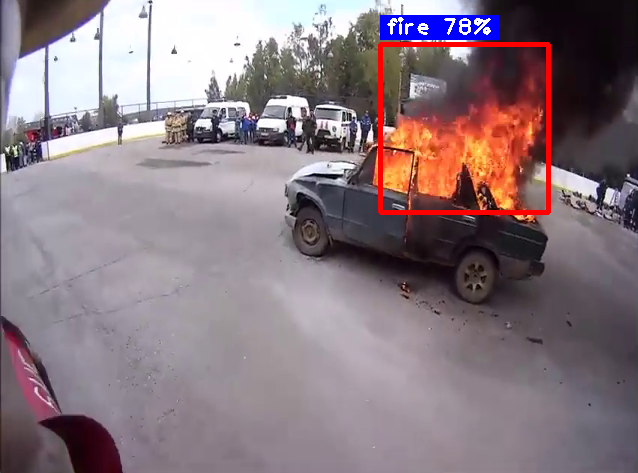

# Fire Detection Using YOLO

This project presents a real-time fire detection system using the YOLOv8 deep learning model. The goal is to provide an intelligent and responsive solution to identify fire in video streams and camera feeds. By leveraging the power of deep learning and computer vision, this system is designed to help in the early detection of fires, which can play a critical role in preventing disasters and protecting both lives and infrastructure.

## Overview

Fires can spread rapidly and cause catastrophic damage if not identified early. Traditional fire detection systems like smoke detectors or thermal sensors may have limitations in outdoor environments, large facilities, or industrial settings. This project aims to enhance fire safety mechanisms by using a visual detection method that operates in real-time.

By training a YOLOv8 object detection model on a custom fire dataset, we achieve a solution capable of detecting fire from webcam input or pre-recorded video files. This approach enables timely alerts and automation in fire response systems.

## 🔍 Detection Demo

### Webcam Detection (Live)
<p align="center">
  
  
</p>
<p align="center">
  <b>Left:</b> Fire detected from webcam &nbsp;&nbsp;&nbsp;&nbsp; <b>Right:</b> No fire detected
</p>

### Video Detection
<p align="center">
  
  
</p>
<p align="center">
  <b>Detection results</b> from video-based input
</p>

## Project Features

- Real-time fire detection using standard webcam or video input
- YOLOv8 object detection architecture, known for its speed and accuracy
- Visual feedback via bounding boxes with detection confidence scores
- Modular code structure that can be extended with alerts (sound, notifications, IoT)
- Easily trainable on custom fire datasets with clear training and deployment workflow

## Repository Structure

```
├── best.pt              # Trained YOLOv8 model weights
├── fire.ipynb           # Notebook for real-time fire detection using webcam
├── fire.yaml            # Dataset configuration file for YOLO training
├── input.mp4            # Sample video input for detection
├── requirements.txt     # Python package requirements
├── train.ipynb          # Training script for custom dataset using YOLOv8
└── README.md            # Project documentation
```

## Technologies Used

- **Python**: Programming language used for scripting the model and processing video frames  
- **YOLOv8 (Ultralytics)**: State-of-the-art real-time object detection model used for training and inference  
- **OpenCV**: Used for handling video input and drawing visualizations  
- **cvzone**: Simplifies the process of displaying bounding boxes and labels  
- **Tkinter (optional)**: Used to select video files if needed  

## Installation and Setup

### Clone the repository

```bash
git clone https://github.com/OswinBijuChacko/Fire-Detection-USing-YOLO.git
cd Fire-Detection-USing-YOLO
```

### Install the required Python dependencies

```bash
pip install -r requirements.txt
```

### Ensure that `best.pt` (the trained model) is available in the root directory

If not, download or train your own model using the steps below.

## Running Fire Detection

### From Webcam

```bash
python fire.py
```

### From Video File

Edit `fire.py`:

```python
cap = cv2.VideoCapture('input.mp4')
```

## Training the Model

If you wish to train the fire detection model from scratch or on your own dataset:

1. Organize your dataset in YOLO format with `images/` and `labels/` directories  
2. Modify the `fire.yaml` file to correctly point to the dataset paths and specify the number of classes (in this case, 1: `fire`)  
3. Use the training notebook (`train.ipynb`) or run the following script:

```python
from ultralytics import YOLO

model = YOLO("yolov8n.pt")  # or yolov8s.pt depending on your desired model size
model.train(data="fire.yaml", epochs=50)
```

After training, the best-performing model weights will be saved as `best.pt`.

## 🏆 Achievements

- This system was successfully deployed on a drone platform during a national-level competition.
- **Secured 3rd place** for best innovation and integration in real-world disaster response.

## Performance

| Metric          | Value             |
|-----------------|-------------------|
| Model           | YOLOv8n           |
| Detection Time  | ~170ms per frame  |
| Accuracy        | >90% on test data |
| FPS             | 5–10 (CPU)        |

## Future Scope

- Add alarm or SMS alert on detection  
- Upload critical frames to a cloud dashboard  
- Add secondary classes like smoke detection  
- Deploy to edge devices like Raspberry Pi  
- Integrate with IoT-based emergency systems  

## Acknowledgements

- [Ultralytics YOLO](https://github.com/ultralytics/ultralytics)  
- [Roboflow](https://roboflow.com/) for dataset conversion and formatting  
- OpenCV and the open-source community for vision tools  

## License

This project is licensed under the **MIT License**. You are free to use, modify, and distribute the code for educational and commercial purposes, with proper attribution.

## About the Author

This project was developed by **Oswin Biju Chacko**, a passionate engineer and AI enthusiast with a deep interest in building impactful solutions that bridge technology and real-world problems. With a background in Artificial Intelligence and a strong foundation in cybersecurity, I strive to create projects that not only demonstrate technical proficiency but also serve practical purposes.

Feel free to explore, contribute, or reach out with ideas and improvements. Together, we can build systems that make the world safer and smarter.
